<div align="center">

# kvfit

### Will your LLM fit? Find out *before* you spend the money.

A tiny, **zero-dependency** planner that tells you whether a language model will fit
on your GPU **or in your CPU's RAM** — how much memory it needs, how the KV cache grows,
what it'll cost, and exactly what to change when it doesn't fit.

[](https://pypi.org/project/kvfit/)
[](https://www.python.org/)
[](LICENSE)
[](pyproject.toml)

```bash
pip install kvfit
kvfit check --model llama-3-8b --gpu a100-40gb --context 8192 --batch 32
```

</div>

<div align="center">
  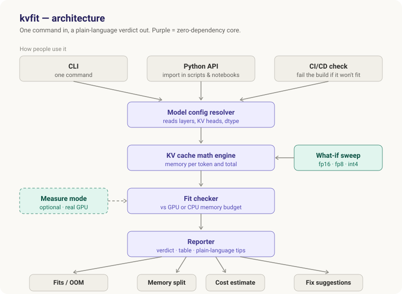
</div>

---

## Table of contents

- [The 30-second version](#the-30-second-version)
- [What is the KV cache?](#what-is-the-kv-cache)
- [The anatomy of GPU memory](#the-anatomy-of-gpu-memory)
- [Why it matters (the part that costs money)](#why-it-matters-the-part-that-costs-money)
- [What kvfit is — and why a package](#what-kvfit-is--and-why-a-package)
- [How it helps engineers & AI product design](#how-it-helps-engineers--ai-product-design)
- [Install](#install)
- [Quickstart](#quickstart)
- [Example output](#example-output)
- [Architecture](#architecture)
- [How a check flows through the code](#how-a-check-flows-through-the-code)
- [How it works (the math, honestly)](#how-it-works-the-math-honestly)
- [Supported models & GPUs](#supported-models--gpus)
- [Honest limitations](#honest-limitations)
- [Roadmap](#roadmap)
- [Development](#development)
- [License](#license)

---

## The 30-second version

Running an LLM on your own hardware isn't automatic — the model has to live in the
memory of a GPU. The catch almost nobody plans for: **the longer the conversation gets,
the more GPU memory the model quietly consumes.** A model that runs fine on a short
prompt can slow to a crawl or crash outright on a long one.

Today, most teams find this out *after* they've provisioned the hardware. `kvfit` moves
that discovery to the start:

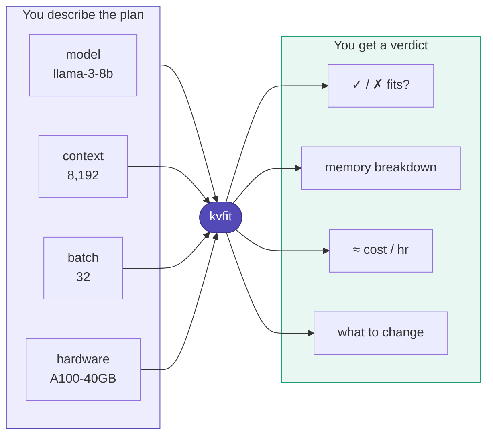

One command. No GPU required to run it. Nothing to rewrite in your stack.

---

## What is the KV cache?

When a transformer generates text, it produces one token at a time, and each new token
has to "look back" at every token before it. To avoid recomputing that history on every
single step, the model stores it — those stored vectors are the **Key-Value (KV) cache**.

The important property is that **the cache grows with every token in the sequence**:

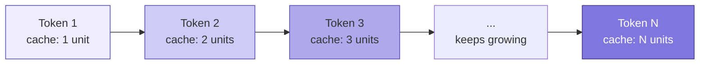

The cache is what makes generation fast — but it's also what makes memory blow up on
long contexts and large batches. Its size is a simple, exact formula:

```
KV cache bytes per token = 2  ×  layers  ×  kv_heads  ×  head_dim  ×  bytes_per_element
```

Total cache = that, multiplied by **context length × batch size**. The `2` is because
both Keys and Values are stored. Crucially it uses **`kv_heads`**, not attention heads —
modern models (Llama-3, Mistral, Qwen) use *grouped-query attention* (GQA), which shares
KV heads to shrink the cache several-fold. Naive calculators miss this; `kvfit` doesn't.

> **GQA vs MHA in one picture** — same model width, wildly different cache. A model with
> 32 query heads but only 8 KV heads caches **4× less** than full multi-head attention.

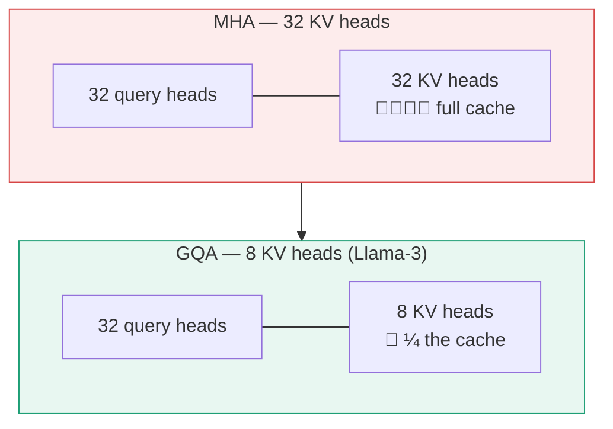

---

## The anatomy of GPU memory

"Will it fit" isn't just about the weights. `kvfit` accounts for **four** things competing
for the same VRAM, and compares their sum against what the card can *actually* give you
(total VRAM minus a driver/CUDA reserve, times a usable fraction):

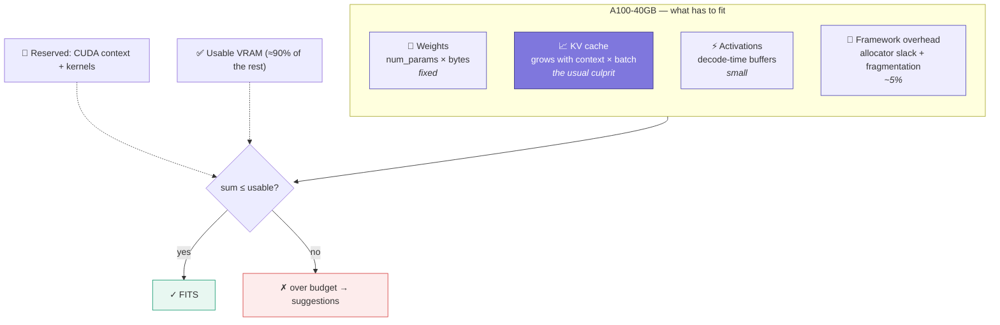

---

## Why it matters (the part that costs money)

At production scale, the KV cache is often **bigger than the model weights themselves**,
and it — not raw compute — is what caps your context length, your batch size, and
therefore your throughput and cost per token.

A worked example for a Llama-3-8B-class model in fp16:

| Quantity | Value |
|---|---|
| KV cache per token | ~128 KiB |
| 4K context, 1 sequence | ~0.5 GiB |
| 8K context, batch of 32 | **~32 GiB** — larger than the 16 GiB of weights |

The failure mode without planning looks like this — and `kvfit` short-circuits it:

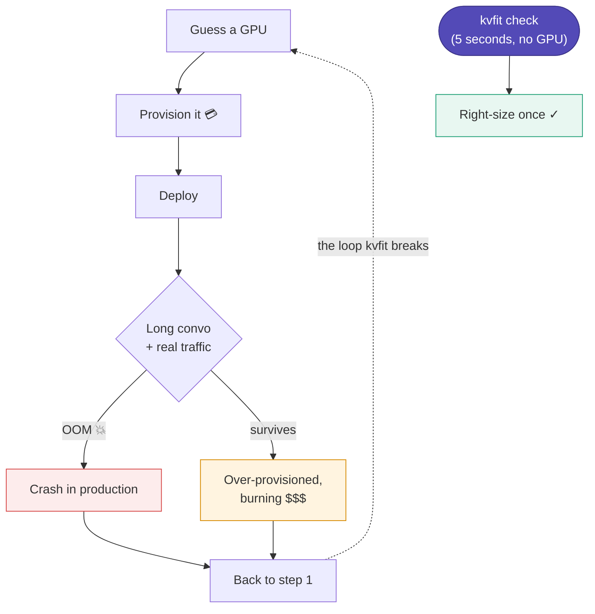

Get this wrong and you crash in production, over-provision expensive GPUs, or burn hours
guessing. Getting it *right* up front is exactly what `kvfit` is for.

---

## What kvfit is — and why a package

`kvfit` is a **planning and checking tool**, not a runtime component. Its whole value is
removing the guesswork before you deploy. It does **not** speed up your model — it tells
you what you're dealing with so you make the right call.

Why ship it as a package rather than a one-off script:

- **`pip install` and go** — no setup, no config, works offline for popular models.
- **Zero runtime dependencies** — the core is pure Python math. Nothing to conflict with
  your existing environment.
- **Three ways to use it** — a CLI you run, a Python API you import, and a CI check that
  fails the build before an over-sized config reaches production.
- **Plugs into what you already have** — reads Hugging Face `config.json` directly, so it
  works with *your* models, not just a hard-coded list.

---

## How it helps engineers & AI product design

`kvfit` turns a fuzzy infra question into a number you can put in a doc, a PR, or a
pricing model. Different roles get different leverage from the same command:

| Role | The question they ask | What kvfit hands them |
|---|---|---|
| **ML / platform engineer** | "Which GPU do we buy/rent for this model?" | Exact memory need + the smallest card that fits, before signing the invoice |
| **Backend / API engineer** | "What max context and batch can I safely expose?" | Concrete `max_context` and `max_batch` ceilings to enforce in code |
| **AI product manager** | "Can we promise 32K context on this tier?" | A fit/no-fit answer per hardware tier, with the cost per hour attached |
| **DevOps / SRE** | "How do we stop an oversized config from shipping?" | A non-zero exit code in CI that blocks the deploy |
| **Founder / solo dev** | "Will this run on my laptop / one cheap GPU?" | RAM and VRAM checks with quantization what-ifs, on any machine |

The through-line: **capacity decisions move from "find out in production" to "decide in a
pull request."**

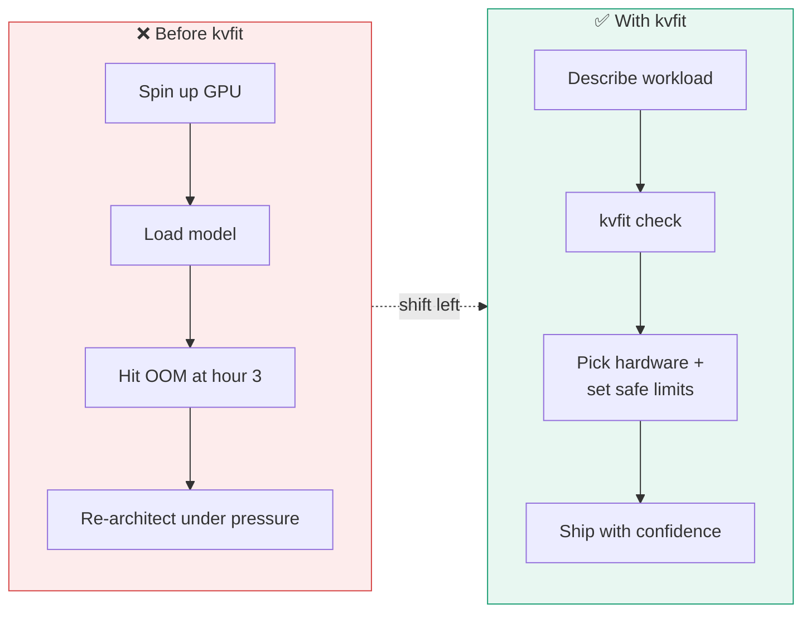

**Where it fits in the product-design loop** — pricing tiers, context limits, and
hardware budgets all depend on the same memory math, so answer it once and reuse it:

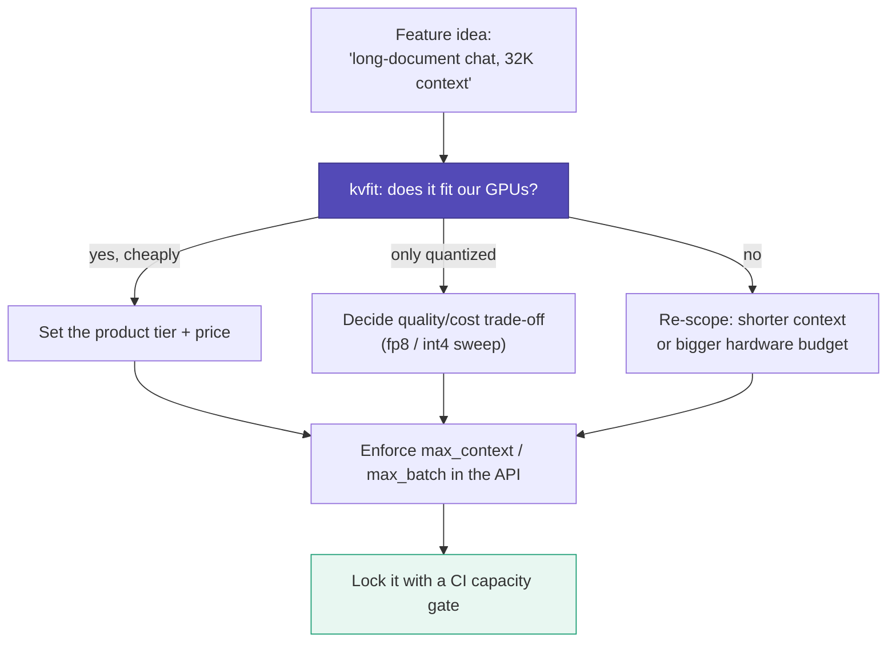

---

## Install

```bash
pip install kvfit
```

Optional extras:

```bash
pip install "kvfit[hub]"      # resolve any model straight from the Hugging Face Hub
pip install "kvfit[measure]"  # (roadmap) validate estimates against a real GPU
```

---

## Quickstart

### 1. Command line

```bash
# Does Llama-3-8B fit on a 40GB A100 with 8K context and batch 32?
kvfit check --model llama-3-8b --gpu a100-40gb --context 8192 --batch 32

# Short flags work too
kvfit check -m mistral-7b -g rtx-4090 -c 32768 -b 1

# Point at your own model's config.json (or a Hugging Face repo id with [hub])
kvfit check -m ./my-model/config.json -g h100 -c 16384

# Compare KV cache precisions
kvfit sweep -m llama-3-70b -g a100-80gb -c 32768

# List what's built in
kvfit models
kvfit gpus
kvfit cpus
```

### No GPU? Check against your RAM instead

`kvfit` runs on any machine — the estimator is pure math, no GPU required. If you plan
to run a model on **CPU** (llama.cpp, Ollama, GGUF, transformers on CPU), check against
your system memory instead of a GPU:

```bash
# Will Llama-3-8B fit in 32 GB of RAM, run as a quantized int4 build?
kvfit check -m llama-3-8b --cpu 32 --context 8192 --weight-dtype int4

# Auto-detect this machine's RAM
kvfit check -m phi-3-mini --cpu auto --context 4096 --weight-dtype int4

# Use a friendly preset
kvfit check -m mistral-7b --cpu laptop-16gb --context 8192 --weight-dtype int4
```

On CPU the report speaks in **RAM** rather than VRAM, skips the GPU cost line, and reminds
you that CPU inference is much slower — the check is about whether it *fits*, not how fast
it runs. Tip: on CPU people almost always run **quantized** models, so pass
`--weight-dtype int4` (or `int8`) for a realistic estimate.

### 2. Python

```python
import kvfit

fit = kvfit.check("llama-3-8b", gpu="a100-40gb", context=8192, batch=32)

print(fit.fits)              # True / False
print(fit.headroom_gib)      # spare memory (negative if over budget)
print(fit.max_context)       # largest context that would fit at this batch
print(fit.suggestions)       # what to change if it doesn't fit

# No GPU? Check against CPU RAM instead (GiB number, "auto", or a preset)
cpu_fit = kvfit.check("llama-3-8b", cpu=32, context=8192, weight_dtype="int4")
print(cpu_fit.fits, cpu_fit.gpu.memory_label)   # -> True RAM

# Full formatted report as a string
print(kvfit.report_text("llama-3-8b", gpu="a100-40gb", context=8192, batch=32))

# Just the numbers
mem = kvfit.estimate_memory(
    kvfit.resolve_model("llama-3-8b"),
    kvfit.Workload(context_length=8192, batch_size=32),
)
print(mem.as_gib())          # {'weights': ..., 'kv_cache': ..., 'total': ...}
```

### 3. CI/CD guard

`kvfit check` exits non-zero when a workload won't fit, so it drops straight into a
pipeline. If someone bumps the model or raises max context past what your GPUs hold,
the build fails *before* it ships:

```yaml
# .github/workflows/capacity.yml
- name: Verify model fits target GPU
  run: |
    pip install kvfit
    kvfit check --model ./model/config.json --gpu a100-80gb --context 32768 --batch 16
```

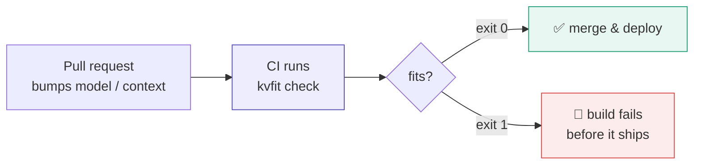

---

## Example output

`kvfit` on a GPU target that's over budget — note the suggestions and the sweep showing that fp8/int4 would fit:

```text
  kvfit  •  Llama-3-8B on a100-40gb
  context 8,192 · batch 32 · kv fp16 · weights fp16 · attention GQA (8/32 kv heads)

  Weights       14.96 GiB  ███████░░░░░░░░░░░░░░░░░
  KV cache      32.00 GiB  ████████████████░░░░░░░░
  Activations    0.00 GiB  ░░░░░░░░░░░░░░░░░░░░░░░░
  Overhead       2.35 GiB  █░░░░░░░░░░░░░░░░░░░░░░░
  Total         49.31 GiB
  Usable VRAM   35.33 GiB  (40 GiB card)

  ✗ DOES NOT FIT  over by 13.98 GiB  (140% of usable memory)
  max context ~4,783  ·  max batch 19  at these settings
  ~$1.20/hr on-demand (rough)

  What would make it fit:
    → Quantize the KV cache to int4 (kv_dtype=int4) — this alone gets you under budget, at a small quality cost.
    → Reduce max context to ~4,783 tokens at this batch size to fit.
    → Reduce batch size to 19 at this context length to fit.


  KV cache what-if sweep
  dtype       kv cache       total    fits
  fp16        32.00 GiB    49.31 GiB      no
  fp8         16.00 GiB    32.51 GiB     yes
  int4         8.00 GiB    24.11 GiB     yes
```

The same tool checking a **CPU / RAM** target (a 32 GB laptop, quantized int4 weights):

```text
  kvfit  •  Llama-3-8B on cpu
  context 8,192 · batch 1 · kv int8 · weights int4 · attention GQA (8/32 kv heads)

  Weights        3.74 GiB  ████████████████████░░░░
  KV cache       0.50 GiB  ███░░░░░░░░░░░░░░░░░░░░░
  Activations    0.00 GiB  ░░░░░░░░░░░░░░░░░░░░░░░░
  Overhead       0.21 GiB  █░░░░░░░░░░░░░░░░░░░░░░░
  Total          4.45 GiB
  Usable RAM    27.00 GiB  (32 GiB system)

  ✓ FITS  22.55 GiB headroom  (16% of usable memory)
  max context ~360,038  ·  max batch 44  at these settings
  note: CPU inference is much slower than GPU; this checks whether it fits in RAM, not how fast it runs.
```

---

## Architecture

`kvfit` is deliberately layered so the math at its core is trivial to read, test, and
trust. Each module does one thing, and dependencies only ever point downward toward the
pure formula:

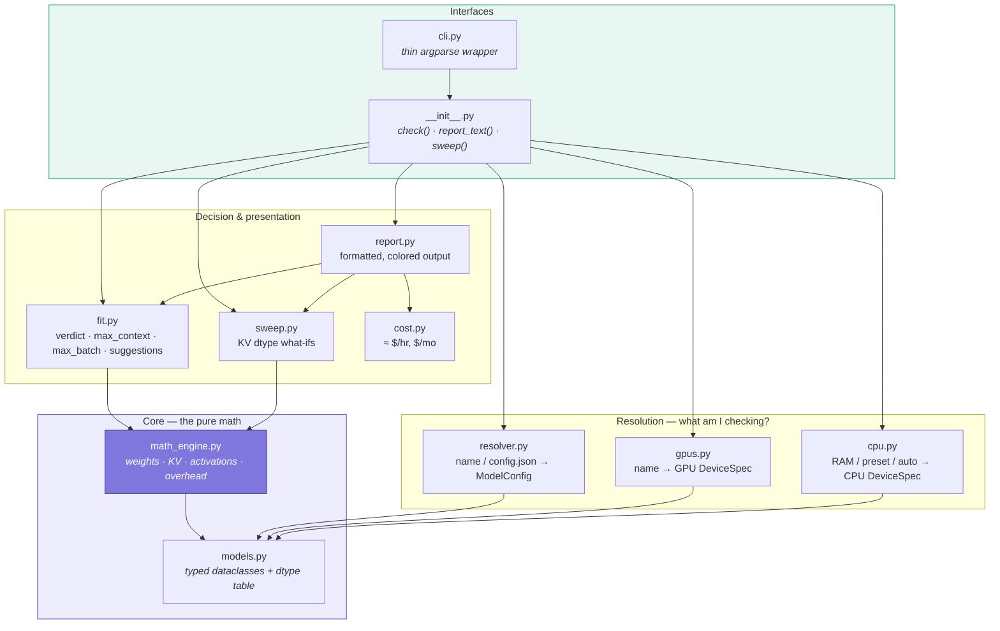

**Design principle:** everything below `fit.py` is a *pure function* of a `ModelConfig`
and a `Workload` — no I/O, no GPU, no network, no global state. That's what makes the
estimates reproducible and the tests fast.

---

## How a check flows through the code

A single `kvfit check` call walks the layers top-to-bottom and comes back with a verdict:

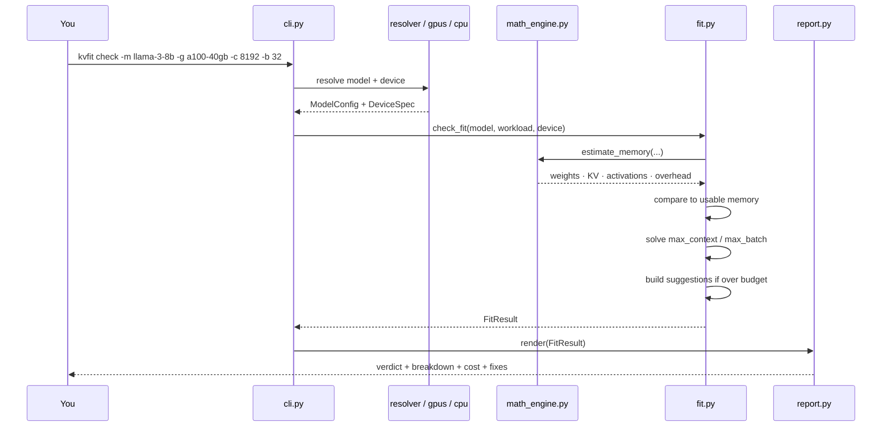

And the decision logic inside `fit.py` when a workload is over budget — it doesn't just
say "no," it works out the concrete knobs that make it a "yes":

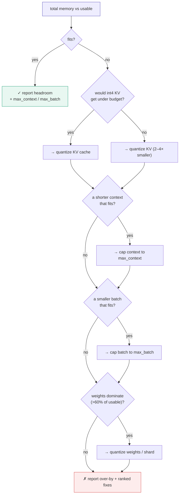

---

## How it works (the math, honestly)

`kvfit` estimates four memory components and compares their sum to your GPU's usable
memory:

1. **Weights** — `num_params × bytes_per_element`.
2. **KV cache** — the formula above, capped by the sliding-window size for models that
   use one (e.g. Mistral), so a longer context costs nothing past the window.
3. **Activations** — a conservative estimate of peak decode-time buffers.
4. **Framework overhead** — allocator slack and fragmentation, modeled as a small
   percentage.

Usable GPU memory is the card's VRAM minus a CUDA-context reserve, times a usable
fraction (defaults mirror how vLLM reserves memory in practice).

These are **estimates, not a profiler**. They're deliberately a little conservative and
are meant for capacity planning — expect them to be close, not exact. For ground truth
on specific hardware, an optional `measure` mode (on the roadmap) will validate estimates
against a real `model.generate()` run.

---

## Supported models & GPUs

Built-in models resolve instantly with no network:

`Llama-3-8B` · `Llama-3-70B` · `Llama-2-7B` · `Llama-2-13B` · `Mistral-7B` ·
`Qwen2.5-7B` · `Qwen2.5-72B` · `Phi-3-mini` · `Gemma-2-9B` · `Gemma-2-27B`

**Any other model** works via its Hugging Face `config.json` — either a local path or,
with `kvfit[hub]`, a repo id. Run `kvfit models` for the current list.

Built-in GPUs include `H200`, `H100`, `A100-40/80GB`, `L40S`, `L4`, `A10G`, `V100`,
`T4`, `RTX-4090/3090`, and more. Any custom size works with `--gpu name:GiB`
(e.g. `--gpu mycard:48`). Run `kvfit gpus` for the full list.

**CPU / RAM targets** work the same way via `--cpu`: pass a GiB number (`--cpu 32`),
`auto` to detect the current machine, `name:GiB`, or a preset like `laptop-16gb`,
`desktop-64gb`, or `mac-m3-max-64gb`. Run `kvfit cpus` for the full list.

---

## Honest limitations

- It's an **estimator**, not a benchmark. Real memory depends on the serving engine,
  attention kernel, and allocator behavior.
- Parameter counts for models resolved purely from `config.json` are approximated from
  dimensions when the config doesn't state them.
- Cost figures are rough, drift over time, and should be checked against your provider.
- It models standard decoder-only attention. Exotic architectures (state-space models,
  cross-attention-heavy encoder-decoders) aren't the target.

If accuracy matters for a decision, treat `kvfit` as the fast first pass and confirm the
borderline cases on real hardware.

---

## Roadmap

- [ ] `measure` mode: validate estimates against a real GPU via `transformers`.
- [ ] Prefill vs. decode memory-over-time curve.
- [ ] Multi-GPU / tensor-parallel sharding math.
- [ ] Prefix-cache / shared-prompt savings modeling.
- [ ] Export reports as JSON and Markdown.

Contributions welcome — see below.

---

## Development

```bash
git clone https://github.com/your-org/kvfit
cd kvfit
pip install -e ".[dev]"

pytest            # run tests
ruff check .      # lint
mypy src          # type-check
```

The codebase is small and deliberately layered: `math_engine.py` is the pure formula,
`fit.py` turns numbers into verdicts, `report.py` handles presentation, and `cli.py` is a
thin wrapper. Contributions that add models/GPUs, improve the estimates, or add the
`measure` mode are especially welcome.

---

## License

MIT — see [LICENSE](LICENSE).
