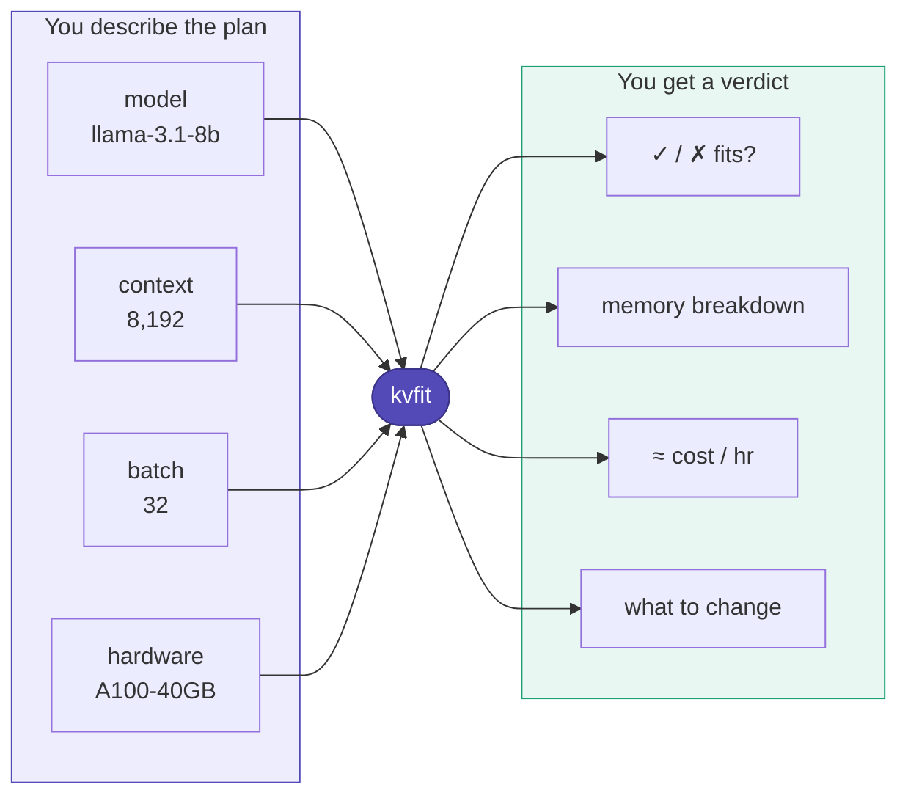
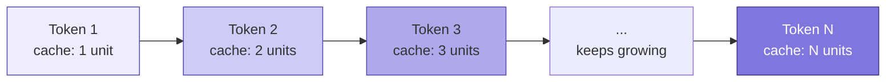
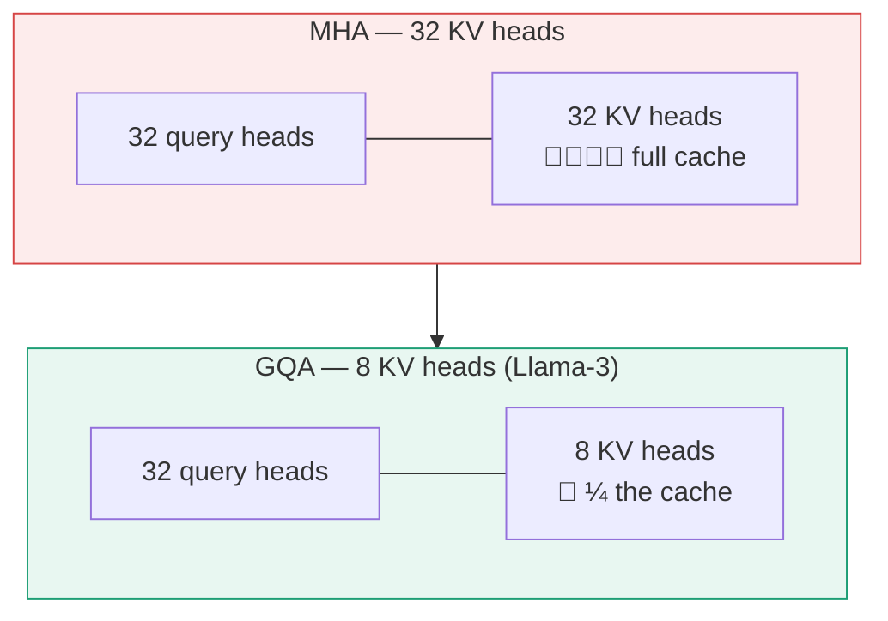
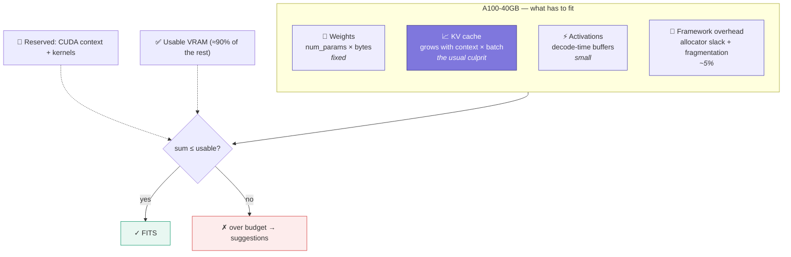
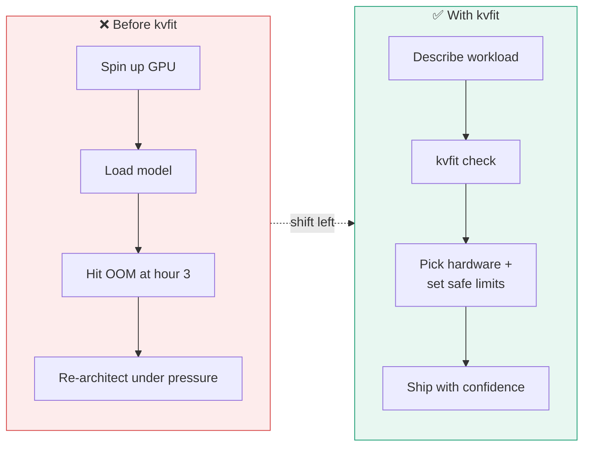
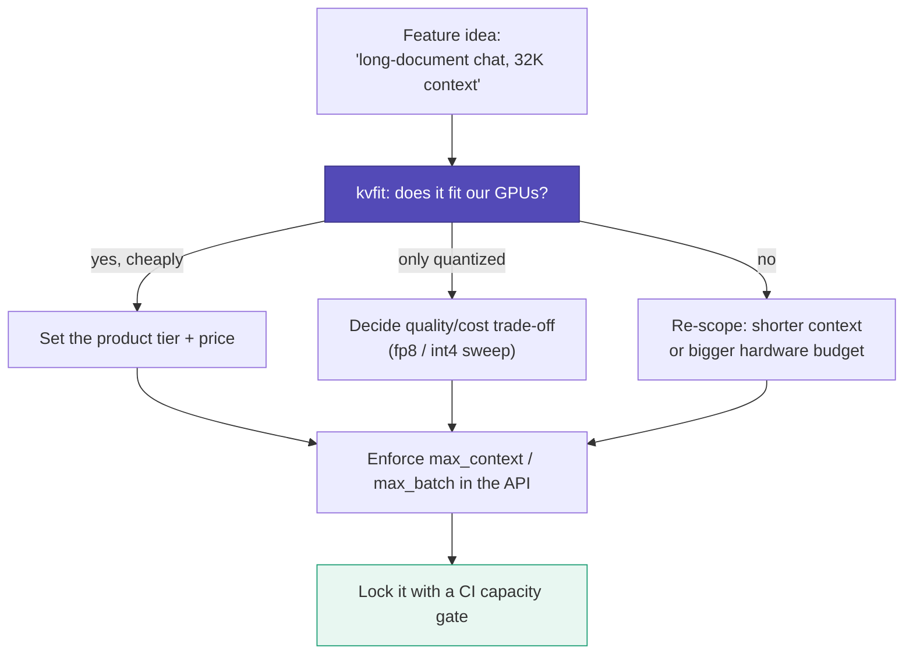
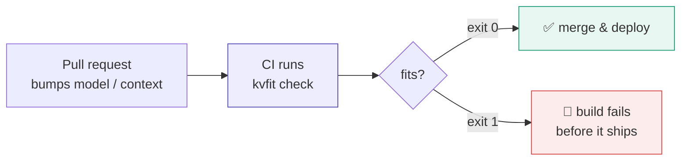
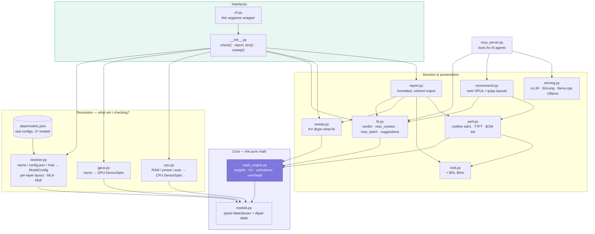
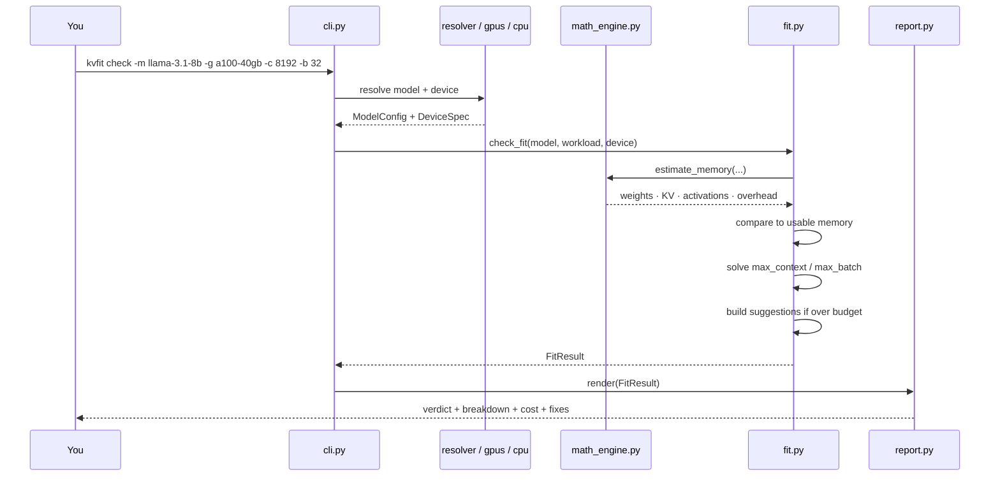
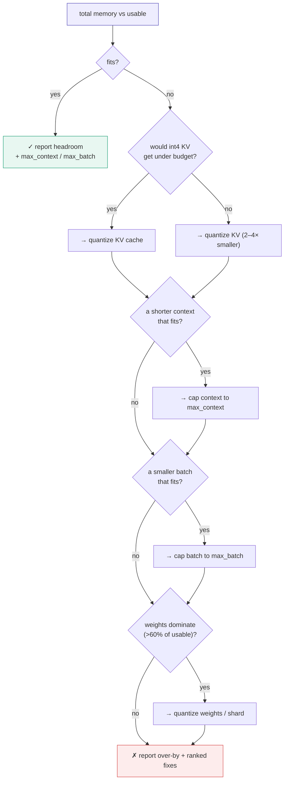

<p align="center">
  
</p>

# ✦ kvfit — Will your LLM fit?

[](https://python.org)
[](https://pypi.org/project/kvfit/)
[](pyproject.toml)
[](https://opensource.org/licenses/MIT)

> A tiny, **zero-dependency** planner that tells you whether a language model will fit
> on your GPU **or in your CPU's RAM** — how much memory it needs, how the KV cache
> grows, what it'll cost, and exactly what to change when it doesn't fit. Drop it into
> any Python app, notebook, CI pipeline, or serving stack.
>
> **v0.2** understands how today's models actually work: interleaved sliding-window
> attention (Gemma 3, gpt-oss), latent attention (DeepSeek-V3, Kimi K2, GLM-5),
> mixture-of-experts, and linear-attention / Mamba hybrids (Qwen3-Next, Qwen3.8,
> Nemotron-H). A naive calculator can be off by **2–25×** on these; see
> [Modern architectures](#-modern-architectures-why-naive-calculators-get-it-wrong).
> It also shards across GPUs (`--tp/--pp`), estimates **tokens/s and $ per 1M tokens**,
> ranks the hardware that fits (`kvfit recommend`), prints the **vLLM / SGLang /
> llama.cpp / Ollama launch command**, and runs as an **MCP server** for coding agents.

```bash
# from the project folder
pip install -e .
kvfit check --model llama-3.1-8b --gpu a100-40gb --context 8192 --batch 32
```

<p align="center">
  
</p>

---

## 📑 Table of Contents

- [📖 What Is It?](#-what-is-it)
- [🧠 What is the KV cache?](#-what-is-the-kv-cache)
- [🆕 Modern architectures](#-modern-architectures-why-naive-calculators-get-it-wrong)
- [🧬 The anatomy of GPU memory](#-the-anatomy-of-gpu-memory)
- [💸 Why it matters (the part that costs money)](#-why-it-matters-the-part-that-costs-money)
- [🎯 Why a package](#-why-a-package)
- [👷 How it helps engineers & AI product design](#-how-it-helps-engineers--ai-product-design)
- [📦 Installation](#-installation)
- [⚡ Quick Start](#-quick-start)
- [🖥️ No GPU? Check against your RAM](#️-no-gpu-check-against-your-ram)
- [🧩 Multi-GPU: tensor & pipeline parallelism](#-multi-gpu-tensor--pipeline-parallelism)
- [⚡ Speed and cost per token](#-speed-and-cost-per-token)
- [🧭 Which hardware? `kvfit recommend`](#-which-hardware-kvfit-recommend)
- [🚀 From plan to launch command](#-from-plan-to-launch-command)
- [🤖 Use it from AI agents (MCP)](#-use-it-from-ai-agents-mcp)
- [🧾 Example output](#-example-output)
- [🏗️ Architecture](#️-architecture)
- [🔀 How a check flows through the code](#-how-a-check-flows-through-the-code)
- [🧮 How it works (the math, honestly)](#-how-it-works-the-math-honestly)
- [🗂️ Package Structure](#️-package-structure)
- [🧰 Supported models & GPUs](#-supported-models--gpus)
- [🚧 Honest limitations](#-honest-limitations)
- [🛣️ Roadmap](#️-roadmap)
- [🔧 Development](#-development)
- [📜 License](#-license)
- [🔖 Cite](#-cite)

---

## 📖 What Is It?

Running an LLM on your own hardware isn't automatic — the model has to live in the
memory of a GPU. The catch almost nobody plans for: **the longer the conversation gets,
the more GPU memory the model quietly consumes.** A model that runs fine on a short
prompt can slow to a crawl or crash outright on a long one.

Today, most teams find this out *after* they've provisioned the hardware. `kvfit` moves
that discovery to the start:



> **The honest thesis.** `kvfit` is a **planning and checking tool**, not a runtime
> component. It does *not* speed up your model — it tells you what you're dealing with
> so you make the right call **before** you spend the money. One command, no GPU
> required to run it, nothing to rewrite in your stack.

---

## 🧠 What is the KV cache?

When a transformer generates text, it produces one token at a time, and each new token
has to "look back" at every token before it. To avoid recomputing that history on every
single step, the model stores it — those stored vectors are the **Key-Value (KV) cache**.

The important property is that **the cache grows with every token in the sequence**:



The cache is what makes generation fast — but it's also what makes memory blow up on
long contexts and large batches. Its size is a simple, exact formula:

```
KV cache bytes per token = 2  ×  layers  ×  kv_heads  ×  head_dim  ×  bytes_per_element
```

Total cache = that, multiplied by **context length × batch size**. The `2` is because
both Keys and Values are stored. Crucially it uses **`kv_heads`**, not attention heads —
modern models (Llama-3, Mistral, Qwen) use *grouped-query attention* (GQA), which shares
KV heads to shrink the cache several-fold. Naive calculators miss this; `kvfit` doesn't.

> **GQA vs MHA in one picture** — same model width, wildly different cache. A model with
> 32 query heads but only 8 KV heads caches **4× less** than full multi-head attention.



---

## 🆕 Modern architectures: why naive calculators get it wrong

The `2 × layers × kv_heads × head_dim` formula assumes **every layer caches every
token**. Most models released since 2024 break that assumption, so `kvfit` models
attention **layer by layer**, reading the layout straight from each model's
`config.json`:

| Architecture | Examples | What gets cached | Naive formula is… |
|---|---|---|---|
| **Full attention (GQA/MQA/MHA)** | Llama 3.x, Qwen3, Mistral, Phi-4 | K + V per KV head, every token, every layer | correct |
| **Interleaved sliding window** | Gemma 2 (1:1), Gemma 3 (5:1), gpt-oss (1:1), MiMo | Local layers keep only the last *W* tokens (128–4,096); global layers keep all | **~2–5× too high** at long context |
| **Chunked attention** | Llama 4 | 3 of 4 layers cache ≤ one 8K chunk | ~2–3.5× too high at 32K–128K |
| **Multi-head latent attention (MLA)** | DeepSeek-V3/R1, Kimi K2, GLM-5 | One compressed latent (`kv_lora_rank + rope_dim` = 576 values) per token per layer, shared by all heads | **~25× too high** if you read `num_key_value_heads` |
| **Sparse-attention indexer (DSA)** | GLM-5, DeepSeek-V3.2 | MLA latent + small indexer key per token | indexer adds ~5–25% on top of MLA |
| **Linear attention / SSM hybrids** | Qwen3-Next, Qwen3.8, Nemotron-H, Granite 4, Jamba | Only 1 in 4–14 layers has a KV cache; the rest hold a fixed-size state that doesn't grow with context | **~4–12× too high** |
| **Mixture-of-experts** | DeepSeek-V3, Qwen3-235B-A22B, gpt-oss, GLM-4.5 | *All* experts must be resident, even though only a few run per token | weights badly underestimated if experts aren't counted (DeepSeek-V3: 38B vs 671B) |

Measured on real configs (KV cache at 32K context, fp16, one sequence):

| Model | Naive (every layer, every token) | `kvfit` 0.2 |
|---|---:|---:|
| Gemma-3-27B | 15.5 GiB | **2.9 GiB** |
| DeepSeek-V3 | 53.4 GiB | **2.1 GiB** |
| Qwen3.8-27B | 8.0 GiB | **2.1 GiB** |
| gpt-oss-120b | 2.3 GiB | **1.1 GiB** |

When a config uses something `kvfit` can't model exactly yet (per-layer KV
compression, cross-layer KV sharing, n-gram memory tables…), the report says so
with a **note** instead of silently giving a wrong answer.

---

## 🧬 The anatomy of GPU memory

"Will it fit" isn't just about the weights. `kvfit` accounts for **four** things competing
for the same VRAM, and compares their sum against what the card can *actually* give you
(total VRAM minus a driver/CUDA reserve, times a usable fraction):



---

## 💸 Why it matters (the part that costs money)

At production scale, the KV cache is often **bigger than the model weights themselves**,
and it — not raw compute — is what caps your context length, your batch size, and
therefore your throughput and cost per token.

A worked example for a Llama-3-8B-class model in fp16:

| Quantity | Value |
|---|---|
| KV cache per token | ~128 KiB |
| 4K context, 1 sequence | ~0.5 GiB |
| 8K context, batch of 32 | **~32 GiB** — larger than the 16 GiB of weights |

The failure mode without planning looks like this — and `kvfit` short-circuits it:


Get this wrong and you crash in production, over-provision expensive GPUs, or burn hours
guessing. Getting it *right* up front is exactly what `kvfit` is for.

---

## 🎯 Why a package

`kvfit`'s whole value is removing the guesswork before you deploy. Why ship it as a
package rather than a one-off script:

- **`pip install` and go** — no setup, no config, works offline for popular models.
- **Zero runtime dependencies** — the core is pure Python math. Nothing to conflict with
  your existing environment.
- **Three ways to use it** — a CLI you run, a Python API you import, and a CI check that
  fails the build before an over-sized config reaches production.
- **Plugs into what you already have** — reads Hugging Face `config.json` directly, so it
  works with *your* models, not just a hard-coded list.

---

## 👷 How it helps engineers & AI product design

`kvfit` turns a fuzzy infra question into a number you can put in a doc, a PR, or a
pricing model. Different roles get different leverage from the same command:

| Role | The question they ask | What kvfit hands them |
|---|---|---|
| **ML / platform engineer** | "Which GPU do we buy/rent for this model?" | Exact memory need + the smallest card that fits, before signing the invoice |
| **Backend / API engineer** | "What max context and batch can I safely expose?" | Concrete `max_context` and `max_batch` ceilings to enforce in code |
| **AI product manager** | "Can we promise 32K context on this tier?" | A fit/no-fit answer per hardware tier, with the cost per hour attached |
| **DevOps / SRE** | "How do we stop an oversized config from shipping?" | A non-zero exit code in CI that blocks the deploy |
| **Founder / solo dev** | "Will this run on my laptop / one cheap GPU?" | RAM and VRAM checks with quantization what-ifs, on any machine |

The through-line: **capacity decisions move from "find out in production" to "decide in a
pull request."**



**Where it fits in the product-design loop** — pricing tiers, context limits, and
hardware budgets all depend on the same memory math, so answer it once and reuse it:



---

## 📦 Installation

> `kvfit` is not on PyPI yet, so install it **from source**. It needs Python **3.10+**
> and has **zero runtime dependencies** — nothing to compile, no GPU, no model download.

### Recommended — install from source into a virtual environment

```bash
# 1. Get the code
git clone https://github.com/your-org/kvfit
cd kvfit

# 2. Create and activate an isolated environment
python3 -m venv .venv
source .venv/bin/activate          # Windows: .venv\Scripts\activate

# 3. Install kvfit in editable mode (picks up your local edits)
pip install -e .
```

### Verify it worked

```bash
python -c "import kvfit; print('✅ kvfit', kvfit.__version__)"   # -> ✅ kvfit 0.2.0
kvfit --help                                                    # CLI is on your PATH
kvfit check -m llama-3.1-8b -g a100-40gb -c 8192 -b 32          # first real check
```

### Optional extras

```bash
pip install -e ".[hub]"       # resolve any model from the Hugging Face Hub (exact param counts)
pip install -e ".[mcp]"       # run kvfit as an MCP server for coding agents
pip install -e ".[dev]"       # pytest, ruff, mypy — for contributing
```

<details>
<summary><b>Alternatives</b> — no clone, or a plain (non-editable) install</summary>

```bash
# Install directly from GitHub without cloning first
pip install "git+https://github.com/your-org/kvfit"

# Or, from inside a cloned folder, a normal (non-editable) install
pip install .
```

</details>

> **Once it's published to PyPI**, installation becomes the usual one-liner:
> `pip install kvfit`.

---

## ⚡ Quick Start

### Command line

```bash
# Does Llama-3.1-8B fit on a 40GB A100 with 8K context and batch 32?
kvfit check --model llama-3.1-8b --gpu a100-40gb --context 8192 --batch 32

# Short flags work too. Quantized weights: awq, gptq, nf4, nvfp4, mxfp4, q4_k_m, ...
kvfit check -m qwen3-30b-a3b -g rtx-5090 -c 32768 --weight-dtype awq

# MoE + MLA: how many H200s does DeepSeek-V3 need in fp8?
kvfit check -m deepseek-v3 -g h200 -c 32768 --weight-dtype fp8

# Point at your own model's config.json (or a Hugging Face repo id with [hub])
kvfit check -m ./my-model/config.json -g h100 -c 16384
kvfit check -m Qwen/Qwen3.8-27B -g l40s -c 65536        # needs kvfit[hub]

# Shard across GPUs: memory is reported per GPU
kvfit check -m llama-3.3-70b -g h100 -c 32768 -b 16 --weight-dtype fp8 --tp 4

# Which GPUs fit, ranked by cost per million output tokens?
kvfit recommend -m qwen3-30b-a3b -c 32768 -b 8 --weight-dtype awq

# Print the matching serving command (vllm | sglang | llamacpp | ollama)
kvfit check -m gpt-oss-120b -g h100 -c 32768 -b 4 --weight-dtype mxfp4 --emit vllm

# Compare KV cache precisions
kvfit sweep -m llama-3.3-70b -g h200 -c 131072 -b 2 --weight-dtype fp8

# Machine-readable output for scripts, CI, and agents
kvfit check -m gemma-3-27b -g h100 -c 131072 -b 8 --json

# List what's built in
kvfit models --details     # size, active params, max context, attention layout
kvfit gpus
kvfit cpus
```

Useful flags: `--prefill-chunk N` (tokens per prefill step, e.g. vLLM's
`max_num_batched_tokens`; sets the activation peak), `--tp N` / `--pp N`
(parallelism), and `--price USD` (your real per-GPU hourly rate instead of the
built-in rough estimate).

### Python

```python
import kvfit

fit = kvfit.check("llama-3.1-8b", gpu="a100-40gb", context=8192, batch=32)

fit.fits              # True / False
fit.headroom_gib      # spare memory (negative if over budget)
fit.max_context       # largest context that would fit at this batch
fit.suggestions       # what to change if it doesn't fit
fit.to_dict()         # JSON-ready summary

# Full formatted report as a string
print(kvfit.report_text("gemma-3-27b", gpu="rtx-5090", context=32768, weight_dtype="awq"))

# Just the numbers
model = kvfit.resolve_model("deepseek-v3")
model.attention_label    # 'MLA (latent 512+64)'
model.num_active_params  # ~3.8e10 of 6.8e11 total
mem = kvfit.estimate_memory(model, kvfit.Workload(context_length=32768, weight_dtype="fp8"))
mem.as_gib()          # {'weights': ..., 'kv_cache': 2.14, 'total': ...}

# Multi-GPU, speed, hardware choice, serving command
fit = kvfit.check("llama-3.3-70b", gpu="h100", context=32768, batch=16,
                  kv_dtype="fp8", weight_dtype="fp8", tp=4)
perf = kvfit.estimate_performance(fit.model, fit.workload, fit.device)
perf.decode_tok_s_total, perf.usd_per_million_output   # ~733 tok/s, ~$4.85
print(kvfit.serving_command(fit, "vllm"))

for option in kvfit.recommend(model, kvfit.Workload(32768, 8, weight_dtype="fp8"))[:3]:
    print(option.gpu, option.num_devices, option.usd_per_million_output)
```

### CI/CD guard

`kvfit check` exits non-zero when a workload won't fit, so it drops straight into a
pipeline. If someone bumps the model or raises max context past what your GPUs hold,
the build fails *before* it ships:

```yaml
# .github/workflows/capacity.yml
- name: Verify model fits target GPU
  run: |
    pip install kvfit
    kvfit check --model ./model/config.json --gpu a100-80gb --context 32768 --batch 16 --json > capacity.json
```



---

## 🖥️ No GPU? Check against your RAM

`kvfit` runs on any machine — the estimator is pure math, no GPU required. If you plan
to run a model on **CPU** (llama.cpp, Ollama, GGUF, transformers on CPU), check against
your system memory instead of a GPU:

```bash
# Will Llama-3.1-8B fit in 32 GB of RAM, run as a GGUF Q4_K_M build?
kvfit check -m llama-3.1-8b --cpu 32 --context 8192 --weight-dtype q4_k_m

# Auto-detect this machine's RAM
kvfit check -m gemma-3-4b --cpu auto --context 8192 --weight-dtype q4_k_m

# Use a friendly preset (a 128 GB Mac can hold surprisingly big MoE models)
kvfit check -m gpt-oss-120b --cpu mac-m4-max-128gb --context 32768 --weight-dtype mxfp4
```

```python
# From Python, pass a GiB number, "auto", or a preset
cpu_fit = kvfit.check("llama-3.1-8b", cpu=32, context=8192, weight_dtype="q4_k_m")
print(cpu_fit.fits, cpu_fit.device.memory_label)   # -> True RAM
```

On CPU the report speaks in **RAM** rather than VRAM and estimates speed from memory
bandwidth. Use a preset (`laptop-16gb`, `workstation-128gb`, `mac-m4-max-128gb`, …) to get
your machine's bandwidth; a bare GiB number assumes a typical ~60 GB/s desktop. Tip: on CPU people almost always run **quantized** models, so pass the format
you'll actually use (`q4_k_m`, `q5_k_m`, `q8_0`, …). These use the real bits per
weight including block scales, so they're more realistic than plain `int4`.

---

## 🧩 Multi-GPU: tensor & pipeline parallelism

Pass `--tp` (tensor-parallel GPUs) and `--pp` (pipeline stages) and every number
becomes **per GPU**: that's what has to fit on each card. The sharding follows
how serving engines actually lay things out:

- **Weights** split evenly across all `tp × pp` GPUs.
- **KV cache** splits across tensor ranks *by KV head*, and each rank needs at least one.
  With fewer KV heads than GPUs, heads are **replicated**: Qwen3-30B-A3B has 4 KV
  heads, so at `tp=8` each GPU holds ¼ of the cache, not ⅛.
- **MLA latents** (DeepSeek-V3, Kimi K2) aren't per-head, so every tensor rank keeps a
  full copy. Adding GPUs doesn't shrink MLA's cache; pipeline stages do.
- **Pipeline stages** split the layers (and their cache).

When something doesn't fit, `kvfit` searches for the smallest valid layout (`tp` must
divide the attention heads) and tells you, e.g. *"It fits on 8 of these GPUs with
tp=8 (--tp 8)"*.

```text
  kvfit  •  Llama-3.3-70B on 4x h100 (tp=4)
  context 32,768 · batch 16 · kv fp8 · weights fp8
  attention GQA (8/64 kv heads)

  Weights       16.43 GiB  ██████████░░░░░░░░░░░░░░
  KV cache      20.00 GiB  ████████████░░░░░░░░░░░░
  Activations    0.18 GiB  ░░░░░░░░░░░░░░░░░░░░░░░░
  Overhead       1.83 GiB  █░░░░░░░░░░░░░░░░░░░░░░░
  Total         38.44 GiB  per GPU
  Usable VRAM   71.33 GiB  (80 GiB card)

  ✓ FITS  32.89 GiB headroom  (54% of usable memory)
  max context ~84,082  ·  max batch 41  at these settings
  speed ~46 tok/s per sequence · ~733 tok/s total · 32,768-token prompt in ~3.4 s  (roofline, rough)
  ~$12.80/hr for 4 GPUs · ~$4.85 per 1M output tokens  (on-demand, 2026-09)
```

---

## ⚡ Speed and cost per token

Fitting is half the question; the other half is *how fast, and at what price per
token*. `kvfit` estimates both with a **roofline model**, using each GPU's memory
bandwidth and dense bf16 TFLOPS:

- **Decode** is memory-bound: every step streams the weights it needs plus the whole
  KV cache. For MoE models only the experts the batch is routed to are read
  (≈ `1 − (1 − k/E)^batch` of them), which is why MoE models decode fast at small batch.
- **Prefill** (time to first token) is compute-bound: ≈ `2 × active_params × prompt`
  FLOPs, plus attention.
- A fixed **per-layer latency** (kernel launches, MoE routing, tensor-parallel
  all-reduces) is added, since it dominates at small batch and on multi-GPU setups.
- **$ per 1M output tokens** = hourly price ÷ aggregate throughput.

Spot checks against real-world single-stream numbers: Llama-3.1-8B on H100 ≈ 146
tok/s (real ≈ 130–150), Qwen3-30B-A3B AWQ on RTX 5090 ≈ 238 (real ≈ 230–260),
Llama-3.3-70B fp8 on 2×H100 ≈ 48 (real ≈ 40–50). Treat these as **planning
estimates**. Speculative decoding and fp8 tensor cores can beat them, and some
engines or kernels fall short. The CPU presets carry RAM bandwidth, so `--cpu`
checks get a speed estimate too (a Mac M4 Max runs an 8B Q4 model at ~70 tok/s).

---

## 🧭 Which hardware? `kvfit recommend`

Instead of checking GPUs one at a time, let `kvfit` try them all. For each GPU in the
catalog it finds the smallest `tp × pp` layout that fits, estimates speed, and ranks by
**cost per million output tokens**:

```text
$ kvfit recommend -m qwen3-30b-a3b -c 32768 -b 8 --weight-dtype awq

  Hardware that fits, cheapest per token first
  gpu                      gpus  layout      GiB/GPU    max ctx  tok/s/seq  tok/s all     $/hr  $/1M out
  rtx-3090                    2  tp2            20.6     33,637         34        275     0.50      0.51
  rtx-4090                    2  tp2            20.6     33,637         37        292     0.90      0.86
  rtx-5090                    2  tp2            20.6     52,362         57        457     1.50      0.91
  rtx-a6000                   1  tp1            41.1     34,558         18        143     0.50      0.97
  mi300x                      1  tp1            41.1    203,079         99        789     2.90      1.02
  h200                        1  tp1            41.1    143,394         91        731     3.80      1.44
  a100-80gb                   1  tp1            41.1     72,007         44        355     2.00      1.56
  h100                        1  tp1            41.1     72,007         68        547     3.20      1.63
  ... 30 more (use --top 0 to show all)
```

Filter with `--gpus h100,h200,b200`, cap the count with `--max-gpus 4`, hide GPUs
without a known price with `--priced-only`, or get `--json`. Prices are rough
on-demand medians (September 2026). Hyperscalers are often 1.5–3× higher, so pass
your own `--price` to `check` when it matters.

---

## 🚀 From plan to launch command

The numbers `kvfit` just worked out (max context, concurrency, memory fraction,
parallelism, KV dtype) are exactly the flags your serving engine needs. `--emit`
prints them:

```text
$ kvfit check -m llama-3.3-70b -g h100 -c 32768 -b 16 --kv-dtype fp8 --weight-dtype fp8 --tp 4 --emit vllm
...
vllm serve meta-llama/Llama-3.3-70B-Instruct \
  --max-model-len 32768 \
  --max-num-seqs 16 \
  --gpu-memory-utilization 0.90 \
  --max-num-batched-tokens 2048 \
  --tensor-parallel-size 4 \
  --kv-cache-dtype fp8 \
  --quantization fp8
```

Engines: `vllm`, `sglang`, `llamacpp` (GGUF file name from the weight format, slots and
total context worked out, Metal offload on Macs) and `ollama` (environment variables).
The command carries a warning comment if the configuration doesn't fit or exceeds the
model's context limit. Flags follow each engine's documented CLI, so double-check
against the version you run.

---

## 🤖 Use it from AI agents (MCP)

Coding agents are increasingly the ones picking models and writing deployment
configs. `kvfit` ships an [MCP](https://modelcontextprotocol.io) server so they can
ask "will it fit?" instead of guessing:

```bash
pip install "kvfit[mcp]"
claude mcp add kvfit -- kvfit mcp      # Claude Code; any MCP client works (stdio)
```

Tools: `check_fit` (with optional serving command), `recommend_hardware`,
`kv_dtype_sweep`, `list_models`, `list_hardware`. All return structured JSON, and
mistakes (unknown model, bad `tp`) come back as readable errors the agent can fix.

---

## 🧾 Example output

`kvfit` on a GPU target that's over budget. Note the suggestions, and the sweep
showing that fp8/int4 KV would fit:

```text
  kvfit  •  Llama-3.1-8B on a100-40gb
  context 8,192 · batch 32 · kv fp16 · weights fp16
  attention GQA (8/32 kv heads)

  Weights       14.96 GiB  ███████░░░░░░░░░░░░░░░░░
  KV cache      32.00 GiB  ████████████████░░░░░░░░
  Activations    0.19 GiB  ░░░░░░░░░░░░░░░░░░░░░░░░
  Overhead       2.36 GiB  █░░░░░░░░░░░░░░░░░░░░░░░
  Total         49.50 GiB
  Usable VRAM   35.33 GiB  (40 GiB card)

  ✗ DOES NOT FIT  over by 14.18 GiB  (140% of usable memory)
  max context ~4,735  ·  max batch 18  at these settings
  ~$1.30/hr  (on-demand, 2026-09)

  What would make it fit:
    → Quantize the KV cache to int4 (kv_dtype=int4) — this alone gets you under budget, at a small quality cost.
    → Reduce max context to ~4,735 tokens at this batch size to fit.
    → Reduce batch size to 18 at this context length to fit.


  KV cache what-if sweep
  dtype       kv cache       total    fits
  fp16        32.00 GiB    49.50 GiB      no
  fp8         16.00 GiB    32.70 GiB     yes
  int4         8.00 GiB    24.30 GiB     yes
```

A hybrid-attention model on a consumer card. Gemma 3 keeps only 1,024 tokens on 52
of its 62 layers, so 32K context costs under 3 GiB of cache:

```text
  kvfit  •  Gemma-3-27B on rtx-5090
  context 32,768 · batch 1 · kv fp16 · weights awq
  attention GQA (16/32 kv heads), 52/62 sliding@1,024

  Weights       13.57 GiB  ███████████████████░░░░░
  KV cache       2.91 GiB  ████░░░░░░░░░░░░░░░░░░░░
  Activations    0.25 GiB  ░░░░░░░░░░░░░░░░░░░░░░░░
  Overhead       0.84 GiB  █░░░░░░░░░░░░░░░░░░░░░░░
  Total         17.56 GiB
  Usable VRAM   28.12 GiB  (32 GiB card)

  ✓ FITS  10.56 GiB headroom  (62% of usable memory)
  max context ~164,623  ·  max batch 4  at these settings
  speed ~74 tok/s per sequence · 32,768-token prompt in ~18.3 s  (roofline, rough)
  ~$0.75/hr · ~$2.83 per 1M output tokens  (on-demand, 2026-09)
```

A frontier MoE model that can't fit on one GPU. `kvfit` works out the smallest valid
multi-GPU layout instead of suggesting knobs that can't help:

```text
  kvfit  •  DeepSeek-V3 on h200
  context 32,768 · batch 1 · kv fp16 · weights fp8
  attention MLA (latent 512+64) · MoE 685B total / ~38.2B active

  Weights      637.52 GiB  ███████████████████████░
  KV cache       2.14 GiB  ░░░░░░░░░░░░░░░░░░░░░░░░
  ...
  ✗ DOES NOT FIT  over by 545.69 GiB  (532% of usable memory)
  won't fit at any context length  at these settings
  ~$3.80/hr  (on-demand, 2026-09)

  What would make it fit:
    → The weights alone (637.5 GiB) exceed this VRAM. It fits on 8 of these GPUs with tp=8 (--tp 8), or use a much smaller weight format (e.g. weight_dtype=nvfp4 / awq).
    → This is a mixture-of-experts model: all experts must be in memory even though only a few run per token. Offloading experts to CPU RAM (llama.cpp --n-cpu-moe, ktransformers) trades speed for fit.
```

The same tool checking a **CPU / RAM** target (a 32 GB laptop, GGUF Q4_K_M weights):

```text
  kvfit  •  Llama-3.1-8B on cpu
  context 8,192 · batch 1 · kv fp16 · weights q4_k_m
  attention GQA (8/32 kv heads)

  Weights        4.53 GiB  ██████████████████░░░░░░
  KV cache       1.00 GiB  ████░░░░░░░░░░░░░░░░░░░░
  Activations    0.17 GiB  █░░░░░░░░░░░░░░░░░░░░░░░
  Overhead       0.29 GiB  █░░░░░░░░░░░░░░░░░░░░░░░
  Total          5.99 GiB
  Usable RAM    27.00 GiB  (32 GiB system)

  ✓ FITS  21.01 GiB headroom  (22% of usable memory)
  max context ~172,093  ·  max batch 20  at these settings
  speed ~8 tok/s per sequence · 8,192-token prompt in ~5.0 min  (roofline, rough)
  note: Assumes ~60 GB/s RAM bandwidth; use a preset for your machine.
```

---

## 🏗️ Architecture

`kvfit` is deliberately layered so the math at its core is trivial to read, test, and
trust. Each module does one thing, and dependencies only ever point downward toward the
pure formula:



**Design principle:** everything below `fit.py` is a *pure function* of a `ModelConfig`
and a `Workload` — no I/O, no GPU, no network, no global state. That's what makes the
estimates reproducible and the tests fast.

---

## 🔀 How a check flows through the code

A single `kvfit check` call walks the layers top-to-bottom and comes back with a verdict:



And the decision logic inside `fit.py` when a workload is over budget — it doesn't just
say "no," it works out the concrete knobs that make it a "yes":



---

## 🧮 How it works (the math, honestly)

`kvfit` estimates four memory components and compares their sum to your device's usable
memory:

1. **Weights** — `num_params × bytes_per_element`. For MoE models that's *all*
   experts. Quantized formats use their real bits per weight including scales
   (e.g. Q4_K_M ≈ 4.85 bits, AWQ ≈ 4.25, NVFP4 ≈ 4.5).
2. **KV cache** — summed **per layer**: full-attention layers cache the whole
   context, sliding/chunked layers at most their window, MLA layers one compressed
   latent, and linear-attention/SSM layers a fixed state that doesn't grow.
3. **Activations** — the larger of the decode buffers and the prefill peak
   (`prefill_chunk` tokens × hidden + MLP width), plus the fp32 logits buffer
   (vocabularies are now 150K–260K entries).
4. **Framework overhead** — allocator slack and fragmentation, modeled as a small
   percentage.

`max_context` and `max_batch` are solved against exactly the same estimate as the
verdict, so a check at the reported `max_context` is guaranteed to fit.

Usable memory is the card's VRAM (or system RAM) minus a reserve, times a usable
fraction (defaults mirror how vLLM reserves memory in practice).

> These are **estimates, not a profiler**. They're deliberately a little conservative and
> are meant for capacity planning — expect them to be close, not exact. For ground truth
> on specific hardware, an optional `measure` mode (on the roadmap) will validate
> estimates against a real `model.generate()` run.

---

## 🗂️ Package Structure

```
kvfit/
├── __init__.py        # public API — check() · report_text() · sweep() + re-exports
├── models.py          # typed dataclasses (ModelConfig, Workload, DeviceSpec, ...) + dtype table
├── math_engine.py     # the pure formula — weights · KV cache · activations · overhead
├── fit.py             # verdict, max_context / max_batch, ranked suggestions
├── sweep.py           # KV-dtype what-if sweep (fp16 · fp8 · int4)
├── cost.py            # rough $/hr and $/mo estimates (on-demand medians, dated)
├── perf.py            # roofline speed: decode tok/s, prefill time, $ per 1M tokens
├── recommend.py       # rank every GPU × smallest tp/pp layout that fits
├── serving.py         # vLLM / SGLang / llama.cpp / Ollama launch commands
├── mcp_server.py      # MCP tools for coding agents (kvfit mcp)
├── report.py          # formatted, colored terminal output
├── resolver.py        # model name / config.json / HF repo → ModelConfig (layouts, MLA, MoE)
├── data/models.json   # built-in registry: trimmed real config.json files + exact param counts
├── gpus.py            # built-in GPU catalog → DeviceSpec
├── cpu.py             # CPU RAM presets / auto-detect → DeviceSpec
└── cli.py             # argparse CLI (check / recommend / sweep / models / gpus / cpus / mcp)

scripts/build_registry.py   # regenerates data/models.json from tests/fixtures/configs/
```

---

## 🧰 Supported models & GPUs

Built-in models resolve instantly with no network. Each one is a trimmed copy of the
model's real `config.json` with its exact parameter count from the Hub:

| Family | Built-in |
|---|---|
| Llama | `Llama-2-7B/13B` · `Llama-3-8B/70B` · `Llama-3.1-8B` · `Llama-3.2-3B` · `Llama-3.3-70B` · `Llama-4-Scout` |
| Qwen | `Qwen2.5-7B/72B` · `Qwen3-8B/32B` · `Qwen3-30B-A3B` · `Qwen3-235B-A22B` · `Qwen3-Next-80B-A3B` · `Qwen3.8-27B` |
| Gemma | `Gemma-2-9B/27B` · `Gemma-3-4B/12B/27B` |
| Mistral | `Mistral-7B-v0.1/v0.3` · `Mistral-Nemo-12B` · `Mistral-Small-3.2-24B` |
| Phi | `Phi-3-mini` · `Phi-4` · `Phi-4-mini` |
| Frontier MoE | `DeepSeek-V3` (= R1) · `Kimi-K2` · `gpt-oss-20b/120b` · `GLM-4.5` · `GLM-4.5-Air` · `GLM-5.3` |
| Hybrid SSM | `Nemotron-Nano-9B-v2` · `Granite-4.0-H-Small` |

**Any other model** works via its Hugging Face `config.json`: either a local path or,
with `kvfit[hub]`, a repo id (which also fetches the exact parameter count). Nested
multimodal configs (`text_config`) are handled. Run `kvfit models --details` for sizes,
max context, and attention layout.

Built-in GPUs include Blackwell (`B200`, `B300`, `GB200`, `GB300`), Hopper (`H200`,
`H100`, `H100-NVL`, `H20`), AMD Instinct (`MI300X`, `MI325X`, `MI355X`), `A100-40/80GB`,
`L40S`, `L4`, workstation and consumer cards (`RTX-PRO-6000`, `RTX-5090/5080`,
`RTX-4090`, …), and unified-memory boxes (`DGX-Spark`, Strix Halo, Apple M-series). Any custom size works with `--gpu name:GiB`
(e.g. `--gpu mycard:48`). Run `kvfit gpus` for the full list.

**CPU / RAM targets** work the same way via `--cpu`: pass a GiB number (`--cpu 32`),
`auto` to detect the current machine, `name:GiB`, or a preset like `laptop-16gb`,
`desktop-64gb`, or `mac-m4-max-128gb`. Run `kvfit cpus` for the full list.

---

## 🚧 Honest limitations

- It's an **estimator**, not a benchmark. Real memory depends on the serving engine,
  attention kernel, and allocator behavior.
- Parameter counts for models resolved from a local `config.json` (no Hub) are
  estimated from dimensions (MoE- and MLA-aware; typically within a few percent for
  text-only models, lower for multimodal checkpoints whose vision tower isn't counted).
- Speed figures come from a roofline model with fixed efficiency factors. They're
  right to within a small factor, not benchmarks, and are most optimistic for
  large MoE models at batch 1.
- Cost figures are rough on-demand medians, drift quickly, and don't cover every GPU;
  pass `--price` with what you actually pay.
- Architectures move faster than any parser. Features `kvfit` doesn't model exactly
  (e.g. DeepSeek-V4-style KV compression and cross-layer KV sharing) are flagged
  with a note, and the estimate should be treated as approximate.
- Encoder-decoder and cross-attention-heavy models aren't the target.

If accuracy matters for a decision, treat `kvfit` as the fast first pass and confirm the
borderline cases on real hardware.

---

## 🛣️ Roadmap

**Done in 0.2:** per-layer attention (sliding / chunked / linear / MLA / DSA), MoE,
modern dtypes (NVFP4, MXFP4, GGUF K-quants), prefill-aware activations, registry built
from real configs, exact Hub param counts, JSON export, multi-GPU sharding (`--tp`,
`--pp`), roofline speed and $/1M tokens, `kvfit recommend`, serving-command export,
and an MCP server.

**Next:**

- [ ] GPU + CPU offload mode (MoE experts in RAM, llama.cpp `--n-cpu-moe` style).
- [ ] Expert parallelism (`--ep`) for large MoE deployments.
- [ ] Speculative decoding (draft model / MTP heads) memory and speed-up.
- [ ] Prefix-cache / shared-prompt savings and KV-offload tiers (CPU / SSD).
- [ ] Calibration against vLLM's reported KV cache capacity and measured tok/s.
- [ ] Markdown export; a browser playground (the core runs as-is under Pyodide).

Contributions welcome — see below.

---

## 🔧 Development

```bash
git clone https://github.com/your-org/kvfit
cd kvfit
pip install -e ".[dev]"

pytest            # run tests (incl. golden tests on real configs in tests/fixtures/configs)
ruff check .      # lint
mypy src          # type-check
```

**Adding a built-in model:** save its `config.json` into `tests/fixtures/configs/`,
add a row (name, exact param count from
`https://huggingface.co/api/models/<repo>?expand[]=safetensors`, aliases) to
`scripts/build_registry.py`, and run `python scripts/build_registry.py`.

The codebase is small and deliberately layered: `math_engine.py` is the pure formula,
`fit.py` turns numbers into verdicts, `report.py` handles presentation, and `cli.py` is a
thin wrapper. Contributions that add models/GPUs, teach the resolver a new architecture, or
tackle a roadmap item are especially welcome.

---

## 📜 License

MIT. See the license header below.

```
MIT License

Copyright (c) 2026 kvfit contributors

Permission is hereby granted, free of charge, to any person obtaining a copy
of this software and associated documentation files (the "Software"), to deal
in the Software without restriction, including without limitation the rights
to use, copy, modify, merge, publish, distribute, sublicense, and/or sell
copies of the Software, and to permit persons to whom the Software is
furnished to do so, subject to the following conditions:

The above copyright notice and this permission notice shall be included in all
copies or substantial portions of the Software.

THE SOFTWARE IS PROVIDED "AS IS", WITHOUT WARRANTY OF ANY KIND, EXPRESS OR
IMPLIED, INCLUDING BUT NOT LIMITED TO THE WARRANTIES OF MERCHANTABILITY,
FITNESS FOR A PARTICULAR PURPOSE AND NONINFRINGEMENT. IN NO EVENT SHALL THE
AUTHORS OR COPYRIGHT HOLDERS BE LIABLE FOR ANY CLAIM, DAMAGES OR OTHER
LIABILITY, WHETHER IN AN ACTION OF CONTRACT, TORT OR OTHERWISE, ARISING FROM,
OUT OF OR IN CONNECTION WITH THE SOFTWARE OR THE USE OR OTHER DEALINGS IN THE
SOFTWARE.
```

---

## 🔖 Cite

If you build on `kvfit`, please cite:

```bibtex
@misc{kvfit,
  title     = {kvfit: Will your LLM fit? A dependency-free KV-cache & GPU/CPU memory planner},
  year      = {2026},
  publisher = {GitHub},
  url       = {https://github.com/your-org/kvfit}
}
```
